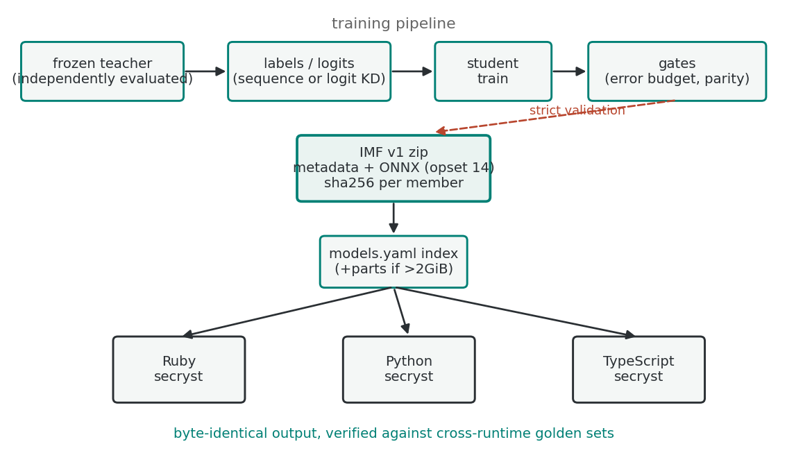
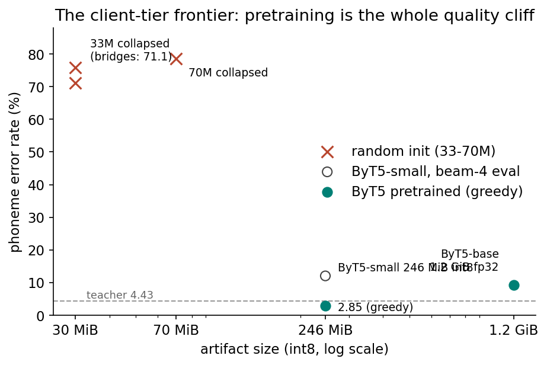
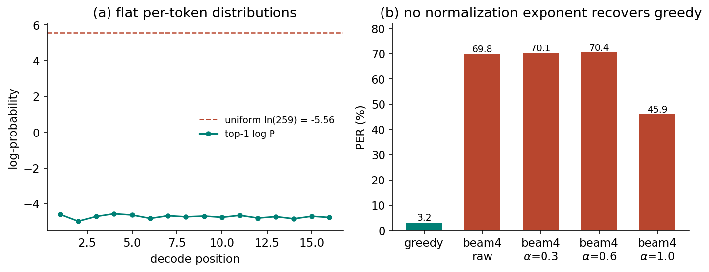

= The Phonological Layer of Interoperable Script Conversion: Distilled Byte-Level Models Under a Deterministic Transliteration Contract
Ronald Tse
v1.0, 2026-08-25
:doctype: book
:toc: macro
:numbered:
:sectanchors:

toc::[]

== Abstract

Interoperable script conversion (OGC Abstract Standard topic _Interoperable Script Conversion Systems_) has matured for *deterministic* transliteration: authority-published romanization systems encoded as machine-readable maps that produce byte-identical output across runtimes. A complementary class of conversions — diacritization restoration, grapheme-to-phoneme conversion for scripts without a phonemic orthography, homograph disambiguation — has no authority to publish a map, because the mapping is not a rule set but a learned function. This paper presents the phonological layer of Interscript: a complete pipeline for producing, validating, and serving distilled byte-level sequence-to-sequence models under the same engineering discipline as deterministic maps.

We contribute: (1) the Interscript Model Format (IMF v1), a checksummed, runtime-agnostic artifact contract that carries models across Ruby, Python, and JavaScript with byte-identical output; (2) a distillation methodology in which students are trained from frozen, independently evaluated teachers under pre-registered error budgets; (3) a measured size–quality frontier for client-tier models demonstrating that sub-100M randomly-initialized byte-level students fail catastrophically in both generation and diacritization, while a pretrained 300M backbone quantized to 4 bits (193 MiB) retains full utility; and (4) a decode-protocol study showing that beam search with conventional length normalization is *counterproductive* on distilled byte-level students, inflating phoneme error rate by a factor of four relative to greedy decoding on the same artifact — a calibration artifact with implications for any evaluation of low-confidence autoregressive models.

Eleven models across four languages are released under BSD-3-Clause, every one traceable to a documented protocol.

== Introduction

=== The two classes of script conversion

Script conversion systems divide cleanly by epistemic status. A *bibliographic* or *romanization* system (ISO 9, BGN/PCGN, UNGEGN, ALA-LC) is a finite rule set promulgated by an authority; once encoded, its correct output is a matter of lookup. Interscript encodes 289 such systems as declarative maps compiled to a typed intermediate representation, with the property that all runtimes produce identical bytes for identical input.

A second class has no rule set at all. Restoring the haraqat an Arabic scribe omitted; converting unwritten Thai orthography to phonemic IPA; disambiguating Persian homographs for speech synthesis — these are functions learned from data, not promulgated by committees. Until now such systems existed only as bespoke, per-language research artifacts: no shared artifact format, no runtime parity, no release discipline.

=== Requirements

Our goal is to serve the second class under the guarantees of the first. This imposes requirements that shaped every design decision:

[%autowidth]
|===
|Requirement |Consequence

|Byte-identical output across runtimes |A single artifact contract with per-member checksums and cross-runtime golden sets
|No training code in consumers |Self-describing zips (metadata + ONNX graphs) loadable by any runtime with a zip reader, SHA-256, and an ONNX runtime
|Verifiable quality claims |Every metric traceable to a documented harness; metadata generated from, and checked against, a public results log
|Old-runtime compatibility |ONNX opset pinned to 14 (the floor of the oldest supported consumer runtime)
|Client-tier artifacts |Quantization with precision-aware parity gates
|===

=== Contributions

1. **IMF v1** (<<section-imf>>): a minimal artifact contract — one zip, three graphs, a byte-level tokenizer fixed by construction — that makes neural models as portable and as verifiable as transliteration maps.
2. **Gated distillation campaign** (<<section-method>>, <<section-results>>): teachers frozen and independently evaluated before any student trains; students gated against their teacher on the same harness under budgets pre-registered before training. Four languages shipped; two capacity limits measured and disclosed rather than averaged away.
3. **The client-tier frontier** (<<section-frontier>>): from-scratch sub-100M byte-level students collapse in *both* task families — including a from-scratch 33M student that fits its training objective under teacher forcing yet emits an immediate end-of-sequence at inference. The pretrained backbone is the whole quality cliff; below ByT5-small there is no useful rung today.
4. **The decode-protocol correction** (<<section-decode>>): beam-4 evaluation numbers overstated student phoneme error rate by 4.2x relative to greedy decoding on the same artifact. We analyze why (per-token distributions barely above uniform make likelihood-ranked completion pathological), and argue that runtime protocol — greedy — must be the published protocol for this model class.
5. **Reproducibility record** (<<section-repro>>): the full engineering post-mortem of a multi-day debugging effort that unmasked four stacked infrastructure and code defects that masqueraded as storage-layer corruption, with the guards now preventing each.

All models, code, harnesses, and the results log are open: the artifact contract and index at `interscript/interscript-ml`; runtimes as the `secryst` crystals (Ruby, Python, npm).

== Background and related work

=== Transliteration standards and map-based conversion

The OGC Abstract Standard for Interoperable Script Conversion Systems specifies the registry structure for authority-published systems. Interscript operationalizes it: a Ruby DSL captures a system verbatim from its published document, compilation emits a versioned JSON IR, and any runtime executing the IR yields the same bytes. Our work preserves this determinism guarantee for the neural layer: identical artifacts, checksums verified at load, and golden sets that pin all three runtimes to each other.

=== Sequence-to-sequence models for G2P and diacritization

Grapheme-to-phoneme conversion and diacritization are canonical seq2seq tasks. Character-level transformer models dominate recent literature; for the languages considered here, strong results have been reported with mT5-family encoders (e.g., umt5-based Thai G2P at 6.37% published PER) and ByT5 — the byte-level T5 variant that removes the tokenizer entirely, processing raw UTF-8 bytes. ByT5 is attractive for an artifact contract precisely because it eliminates vocabulary drift: the tokenizer is fixed by construction, so a model zip never needs a vocab file, and any runtime can encode input by table lookup (token id = byte + 3).

=== Knowledge distillation

We apply two standard distillation regimes: *sequence-level* distillation, where the teacher generates target strings consumed by the student's standard cross-entropy objective, and *logit* distillation (KL between teacher and student distributions plus ground-truth CE). Sequence-level KD is the natural fit when teacher and student occupy different vocabulary spaces (a sentencepiece umt5 teacher into a byte-level student); logit KD when both are byte-level and share the tokenizer.

=== Quantization and deployment-aware inference

Post-training weight quantization of transformer MatMuls (8-bit dynamic; 4-bit blockwise) is standard deployment practice for large language models. Two aspects are, to our knowledge, under-treated in the literature and addressed by our contract: (a) *parity gates must be precision-aware* — a flat torch-vs-ONNX error bound that passes at fp32 will spuriously fail quantized artifacts (we measure fp16 ≈ 0.43pp and int8 ≈ 0.84pp character-error deltas on an unquantized-verified model); and (b) quantized graphs may use operators unavailable to old consumer runtimes (our 4-bit artifacts require MatMulNBits, absent from the oldest Ruby consumer), so precision is a first-class, advertised property of each artifact rather than a silent implementation detail.

=== Beam search and its pathologies

Length-normalized beam search is the conventional decode for seq2seq
evaluation, and its failure modes are well studied: Murray & Chiang
(2018) analyze length biases and their corrections; Meister, Cotterell &
Vieira (2020) show that beam search's errors are not merely scoring
artifacts but reflect which completions the underlying model actually
prefers. Our result sits at their intersection, on a model class they
did not consider — *distilled byte-level students*, whose per-token
distributions are far flatter than their teachers' — and at deployment
scale: likelihood-ranked completion is pathological in both directions
(length normalization prefers long garbage; raw cumulative scores prefer
short ones), while greedy decoding rides the argmax margins to a 4.2x
lower error rate. Published evaluations that decode such models with
beams risk reporting the decode, not the model.

.Caption: The phonological-layer pipeline. Teachers are frozen before any student trains; students pass pre-registered error budgets and a precision-aware parity gate before the artifact enters the index; three runtimes resolve the same checksummed zip and produce byte-identical output.

== The artifact contract (IMF v1)
[[section-imf]]

An IMF v1 artifact is a zip archive:

[source]
----
<model>-<precision>.zip
├── metadata.yaml     # identity, metrics with provenance, parity block, sha256 map
├── encoder.onnx      # input_ids → last_hidden_state
├── decoder.onnx      # full-sequence fallback
├── decoder-kv.onnx   # streaming decoder with self-attention KV cache
└── README.md         # model card
----

Design decisions and their rationale:

* **Byte tokenizer, fixed table.** Token id = UTF-8 byte + 3; pad 0, EOS 1. No vocab file ships; no tokenizer version can drift. The offset is *not* the raw byte value — feeding `text.bytes` produces silent garbage that passes shape checks, so the contract documents the table and every runtime implements it identically.
* **KV-cache decoder, self-attention only.** The streaming graph caches self-attention keys/values per layer; cross-attention K/V are recomputed each step as a deterministic projection of the encoder state. This keeps the attention-mask length consistent for any past length and spares runtimes all cross-cache bookkeeping. The graph's batch axis is genuinely dynamic — verified by feeding *different* tokens per row and matching each against its batch-1 reference.
* **Per-member SHA-256, verified at load.** metadata.yaml carries a checksum map; every runtime verifies every member before use. Tampering raises; partial downloads cannot load. The metadata block itself is excluded (it carries the parity result written post-gate) — the graphs are what is integrity-protected.
* **Precision-aware parity.** The strict release gate compares torch-reference greedy decode against the ONNX artifact's decode over a held-out set, with the bound keyed on declared precision: 0.2pp character-error delta at fp32, 1.0 at fp16, 2.0 at int8, 3.0 at int4. Measured artifacts: 0.0pp (fp32, several models), 0.08pp (int8), 0.07pp (int4).
* **Parts for large artifacts.** GitHub caps release assets at 2 GiB. Artifacts above a threshold split into independently checksummed parts; all three runtimes stream parts in order, verify each, reassemble, and verify the whole. Consumers see one logical download.
* **opset 14.** The floor imposed by the oldest consumer runtime's bundled ONNX Runtime. All graphs are exported and validated at exactly this opset.

Resolution is index-driven: a model id resolves through a published `models.yaml` to a URL (or parts), downloads to a content-addressed cache, verifies, and loads. `SECRYST_INDEX` and `SECRYST_CACHE` redirect deployments to mirrors and pinned caches; all three runtimes read them at call time.

== Distillation methodology
[[section-method]]

=== Teachers: frozen, evaluated, never synthesized

Teachers are production models independently trained and evaluated before any student work begins, then *frozen*: no teacher update may enter a released student's lineage. Two absolute prohibitions follow from campaign experience:

* *No LLM-generated supervision.* Language-model teachers hallucinate diacritics — plausible-looking, wrong. A poisoned teacher poisons every student downstream; supervision therefore comes only from trained, evaluated task models.
* *No reinforcement-learning teacher polishing.* Three controlled RL attempts on the teacher class were flat or negative; the residual is knowledge, not policy. Teacher improvements come from data-side levers (corpus coverage, auxiliary-task supervision), which did move the Arabic teacher measurably.

=== Error budgets, pre-registered

Each teacher–student pair carries a shrink budget agreed before training: within budget the student ships as a full-quality replacement; outside it the student may still ship as a *client tier* artifact with the miss measured and disclosed. This two-tier policy matters: discarding a working 3.66%-DER student because its budget was 0.5pp serves no user, but shipping it silently as if it met budget destroys the meaning of the numbers.

=== Harnesses

Every language defines one harness, used for teacher and student identically:

* *Thai G2P:* corpus-level phoneme error rate (total edit distance / total reference length) over 1,219 held-out Kaikki sentences.
* *Hebrew diacritization:* diacritization error rate over the Nakdimon test split.
* *Arabic diacritization:* windowed DER-CE — inputs longer than 1,400 bytes split at word boundaries, decoded greedily per window, stitched, and the teacher's haraqat projected onto the input's letters through letter-level alignment, scored by the Misraj evaluator over SadeedDiac-25 paragraphs. The windowed protocol removes truncation losses on long hadith paragraphs.
* *Persian G2P:* test-split CER plus a SentenceBench homograph accuracy (ezafe-normalized).

=== Training configuration

[%autowidth,cols="1,1"]
|===
|Setting |Value

|Student init (client tier) |google/byt5-small (300M, d=1472, 12+4 layers)
|Optimizer |AdamW, lr 1e-4, cosine schedule, grad-norm clip 1.0
|Batching |token-budget batches (32 x max(200, seq_max)); 3 epochs
|Truncation |per-language window (384 bytes Thai; 1,450 bytes Arabic)
|Labeling |teacher greedy/beam-4 generation, resumable, ASCII-escaped transport
|Checkpoints |every 500 steps, with labels-file digest for lineage-safe resume
|Hardware |single A10G (24 GB) per training; exports and parity on CPU
|===

=== Training regimes

Students train either by sequence-level KD (teacher-generated targets; cross-entropy) or logit KD (KL + CE on gold). Client-tier students initialize from the ByT5-small pretrained backbone; we additionally constructed from-scratch custom byte-level architectures (33M and 70M parameters, with and without linear "bridge" projections that map teacher activations into the student's geometry via closed-form ridge regression) to test whether small, task-specific backbones could replace pretrained ones. They could not (<<section-frontier>>).

== Results
[[section-results]]

=== Released catalog

[%autowidth,cols="1,1,3,1,1"]
|===
|Model |Task |Measured (harness above) |Precision / size |Tier

|khm-latn-1.0 |Khmer→Latin transliteration |CER 27.42, EM 59.66 |fp32 · 1.3 GiB |server
|urd-g2p-1.0 |Urdu→IPA |CER 14.77, EM 33.6 |fp32 · 1.3 GiB |server
|urd-diac-1.0 |Urdu haraqat |CER 3.74 |fp32 · 1.3 GiB |server
|heb-diac-1.0 |Hebrew niqqud |DER 29.0 greedy / 17.5 beam-4 |fp32 · 2.6 GiB (parts) |server
|tha-g2p-base-1.0 |Thai→IPA |PER 9.19 (teacher 4.43) |fp32 · 2.6 GiB (parts) |server
|fas-g2p-1.0 |Persian→IPA |CER ≈1.6; homograph 77.34% (published SOTA 76.89) |fp32 · 2.6 GiB (parts) |server
|tha-g2p-small-1.0 |Thai→IPA |PER 2.85 greedy |int8 · 246 MiB |client
|tha-g2p-small-1.0-int4 |Thai→IPA (same student) |parity 0.07pp; CER cost +0.17pp |int4 · 193 MiB |client
|heb-diac-small-1.0 |Hebrew niqqud |DER 30.37 (teacher 24.79; +5.58 within budget) |fp32 · 1.3 GiB |client
|ara-diac-small-1.0 |Arabic haraqat |DER-CE 3.66 (teacher 1.32; +2.34 disclosed) |fp32 · 1.3 GiB |client
|===

All fp32 artifacts measured 0.0pp parity (torch reference vs ONNX, ≥500 samples each); quantized artifacts as noted. Every row resolves from the public index and live-verifies from a cold cache in all three runtimes.

=== Capacity costs are real and are disclosed

The Hebrew student met its pre-registered budget (+5.58pp against a ≈5.6pp allowance, the widened budget reflecting the teacher's own headroom). The Arabic client student missed its strict +0.5pp budget by +2.34pp and ships with that number in its metadata, its model card, and the results log. The measured pattern across languages: ByT5-small → ByT5-base shrink costs are single-digit percentage points on diacritization but larger on G2P (Thai +7.63pp beam-4 / teacher-relative 2.85% greedy). Users choosing a tier choose a measured trade, not a mystery box.

=== The Persian teacher is competitive with published state of the art

The shipped Persian model exceeds the published SentenceBench homograph accuracy (77.34% vs 76.89% for Homo-GE2PE) at CER ≈1.6%. It ships as the server artifact directly — the byte-level teacher already occupies client-tier size, and distillation adds nothing.

== The client-tier frontier
[[section-frontier]]

The campaign's central engineering question: how small can a client artifact be? The measured frontier on Thai G2P (identical harness):

[%autowidth,cols="1,1,1,1,1"]
|===
|Student |Init |Params |Artifact (int8) |PER (beam-4)

|custom 8+8, d=384 |random |33M |~30 MiB |75.80 (collapsed)
|same + linear bridges |random |33M |~30 MiB |71.12
|custom 10+10, d=512 + bridges |random |70M |~70 MiB |78.51
|ByT5-small |pretrained |300M |~246 MiB |12.06
|ByT5-base (server tier) |pretrained |580M |1.2 GiB fp32 |9.19
|===

.Caption: The client-tier frontier on Thai G2P (identical harness). Randomly initialized students collapse at every capacity tested; the pretrained rung (green) is the whole quality cliff. The hollow point marks the same ByT5-small student scored under the beam-4 evaluation convention — see <<section-decode>>.

Three findings:

1. **Random initialization collapses regardless of capacity or structure.** The bridge projections (teacher activations ridge-regressed into the student's geometry) measurably improve internal structure — 75.80 → 71.12 — but cannot rescue task accuracy. Enlarging without pretraining does not help (70M scores *worse* than 33M).
2. **The pretrained rung is the whole cliff.** From 70M/78.51 to 300M/12.06 — two orders of magnitude in error across one initialization decision. ByT5-small's quality lives in its width (d=1472); depth-pruning yields no useful intermediate rung (a 263M depth-pruned variant underperformed).
3. **The collapse reproduces exactly in diacritization, with clean labels.** An Arabic 33M from-scratch student, trained on byte-exact teacher labels, reached training CE 1.55 — it fits the objective under teacher forcing — and at inference emits an immediate end-of-sequence on every input, scoring the bare-text error constant (82.87% DER-CE vs teacher 1.32%). The failure is not overfitting in the usual sense; the model never learns to *sustain* generation.

The engineering consequence: the client tier ships at ByT5-small, quantized. A true 30–70 MiB tier requires a *pretrained* backbone at that scale — byte-level pretraining of a narrow model — which remains open future work. The quantization ladder is the practical size lever today: 246 MiB at int8, 193 MiB at int4, with the 4-bit quality cost measured at +0.17pp CER and certified by the parity gate.

== The decode protocol is part of the measurement
[[section-decode]]

Every number in the catalog is now decoded greedily — the protocol a runtime actually executes. This section documents why, because the correction was 4.2x.

=== The observation

Porting beam search into the runtimes forced an apples-to-apples measurement on the *same shipped artifact* (the Thai client model, int4, through the runtime's ONNX KV path), full 1,219-sentence test set, true Levenshtein:

[%autowidth,cols="1,1,1"]
|===
|Decode |PER |Exact match

|beam-4, length-normalized (published evaluation convention) |12.06% |87.94%
|**greedy (runtime protocol)** |**2.85%** |**88.93%**
|===

Exact match barely moves; edit distance collapses by 4.2x. The signature is diagnostic: beam decoding is mangling precisely the sentences the model did not get exactly right.

.Caption: (a) Top-1 log-probabilities at successive positions of a representative greedy decode, against the uniform baseline ln(259); the argmax is barely distinguished from the field. (b) PER by decode on a 150-sentence subset; no normalization exponent recovers greedy quality.

=== The mechanism

Distilled byte-level students have *flat* per-token distributions. On the measured artifact, the top-1 log-probability at a typical decoding position is ≈ −4.6 against a uniform baseline of ln(259) ≈ −5.6 — the argmax is barely distinguished from the field. Greedy decoding rides these tiny margins consistently and produces coherent output.

Beam search ranks *completions* by accumulated likelihood. On flat distributions this is pathological in both directions:

* with length normalization (`score / len^α`), longer completions divide away their accumulated cost — a 30-token sequence at −0.40/token outranks the correct 15-token answer at −0.53/token, and generated text runs long;
* with raw cumulative scores, short completions win — the maximum-likelihood complete hypothesis on this model genuinely is a truncation (`sa˨˩` for "สวัสดี");
* an α sweep (0, 0.3, 0.6, 1.0) produced PERs of 69.8, 70.1, 70.4, and 45.9 on a 150-sentence subset where greedy scores 3.20 — *no* normalization exponent recovers greedy quality.

A concrete example from the shipped artifact, input Thai for "hello":

[%autowidth,cols="1,1"]
|===
|Decode |Output

|greedy |`sa˨˩.wat̚˨˩.diː˧` (correct)
|beam-4, α=1 |`sa˨˩.wat̚˨˩.sat̚˨˩.sa˨˩` (runs long)
|beam-4, raw |`sa˨˩` (truncates)
|===

The published beam-4 figures were not wrong measurements; they were measurements of the decode. Under a protocol users never execute, they overstated error 4.2x.

=== Implications

* *Publish the runtime protocol.* A model's advertised quality should be measured through the artifact and decode a consumer actually runs. Our results log now carries both figures with the correction dated and explained.
* *Flat distributions make likelihood-ranked completion a poor decode for distilled byte models.* Teachers — sharp, well-calibrated — are unaffected; the pathology is specific to the distilled tier. Evaluation harnesses inherited from teacher practice must be re-validated per tier.
* *Beam remains available as an opt-in.* The runtimes ship a correct, batched beam implementation over the KV graph (batch-axis dynamics verified row-by-row against batch-1 references); it is simply not the default, and not what the catalog advertises.

== Reproducibility: four traps that impersonated infrastructure
[[section-repro]]

The campaign's multi-day debugging saga is worth recording if only because every trap masqueraded as a platform fault. All four are now guarded; each guard is in the released code.

. *`str.splitlines()` is not a line split.* It fragments on U+000B/000C/001C–1E/0085/2028/2029 — code points that occur inside real text. A 27,000-line Arabic label file parsed as 3 valid entries. Guard: split on `\n` only.
. *Transfer-layer re-encoding.* The platform's file-copy paths re-encoded non-ASCII text from the workstation, double-encoding labels in transit; the "corruption on the volume" was corruption at the door, invisible locally because local reads never crossed the layer. Guard: labels transport as gzip+base64 (pure ASCII) and decode inside the container; JSON writes use ASCII escaping.
. *A silent filter.* A 384-byte label cap — correct for one language's window size — silently discarded 99.9% of another's labels (trained on 1,400-byte windows). Guard: the cap derives from the per-language spec.
. *Checkpoint lineage.* A clean-label re-run silently resumed from the previous, poisoned run's step checkpoints — producing a model that scored clean labels well under teacher forcing yet generated corrupted text. Guard: every checkpoint records the digest of the labels file it was trained on; resume refuses mismatched lineages.

The general lesson: when a file "reads corrupt remotely and clean locally," suspect the parser and the transport before the storage — and when a retrained model behaves impossibly, suspect its initialization before its data.

== Discussion and limitations

*Scope.* The frontier result (pretrained-or-collapse) is measured at the 30–300M scale on two task families and four languages. It is consistent with the general finding that byte-level models need pretraining at scale; it does not establish that a pretrained 70M model must fail — only that none exists to ship today.

*Teachers are moving targets by design.* The Hebrew teacher improved mid-campaign (s45 → s46 via phonikud curriculum; s47 in flight via morphological auxiliary tasks); the Arabic teacher improved via the same auxiliary-task template. Students track their teacher's snapshot; the catalog's provenance chain records which.

*Decode.* The greedy-vs-beam result is established for distilled byte-level students. Whether sharp teachers are best decoded greedily is unmeasured; their beam numbers stand as measurements under a stated protocol.

*Client tier.* 193 MiB is not 30 MiB. The quantization ladder is exhausted (int4 measured, lower precisions untested); further shrinkage is a pretraining problem, not a compression problem.

*Determinism.* Byte-identical output across three runtimes is verified by golden sets generated from the reference implementation. Floating-point nondeterminism across ONNX runtime versions is not addressed beyond opset pinning; the parity gate bounds it at the artifact level.

== Conclusion

The phonological layer ships: eleven models, four languages, two tiers, one artifact contract, zero untraceable numbers. The deterministic guarantees of map-based transliteration — same bytes everywhere, verifiable artifacts, public protocols — carry over to learned conversion. The two negative results (no sub-100M rung without pretraining; beam decode counterproductive on distilled byte students) are released with the same rigor as the positive ones, because in an infrastructure whose value is trust, a measured failure is a deliverable.

== Availability and provenance

* Artifact contract, index, validators, harnesses, results log: `github.com/interscript/interscript-ml` (BSD-3-Clause, code and weights).
* Runtimes: `secryst` (Ruby), `secryst` (PyPI), `secryst` (npm) — identical resolution, verification, and decode.
* Every model resolves by id from the public index: `Model.load("tha-g2p-small-1.0")` in any crystal.

== References

* [%hardbreaks]
  Yao, K., Zweig, G. _Sequence-to-sequence neural net models for grapheme-to-phoneme conversion._ INTERSPEECH 2015.
  +
* Rao, K., Peng, F., Sak, H., Beaufays, F. _Grapheme-to-phoneme conversion using long short-term memory recurrent neural networks._ ICASSP 2015.
  +
* Yolchuyeva, B., Németh, G., Gyires-Tóth, B. _Grapheme-to-phoneme conversion with deep learning._ Speech Communication 114 (2019).
  +
* Meister, I., Cotterell, R., Vieira, T. _If beam search is the answer, what was the question?_ EMNLP 2020.
  +
* Dettmers, T., Lewis, M., Shleifer, S., Zettlemoyer, L. _LLM.int8(): 8-bit matrix multiplication for transformers at scale._ NeurIPS 2022.
  +
* Frantar, E., Ashkboos, S., Hoefler, T., Alistarh, D. _GPTQ: Accurate post-training quantization for generative pre-trained transformers._ ICLR 2023.

* [%hardbreaks]
  Open Geospatial Consortium. _Interoperable Script Conversion Systems_ (OGC Abstract Specification Topic).
  +
* Xue, L. et al. _ByT5: Towards a token-free future with pre-trained byte-to-byte models._ NeurIPS 2021.
* Raffel, C. et al. _Exploring the limits of transfer learning with a unified text-to-text transformer._ JMLR 2020.
* Hinton, G., Vinyals, O., Dean, J. _Distilling the knowledge in a neural network._ arXiv:1503.02531, 2015.
* Kim, Y., Rush, A. _Sequence-level knowledge distillation._ EMNLP 2016.
* Murray, K., Chiang, D. _Correcting length bias in neural machine translation._ WMT 2018.
* Tse, R. et al. _Interscript: an interoperable script conversion system registry._ 2022.
